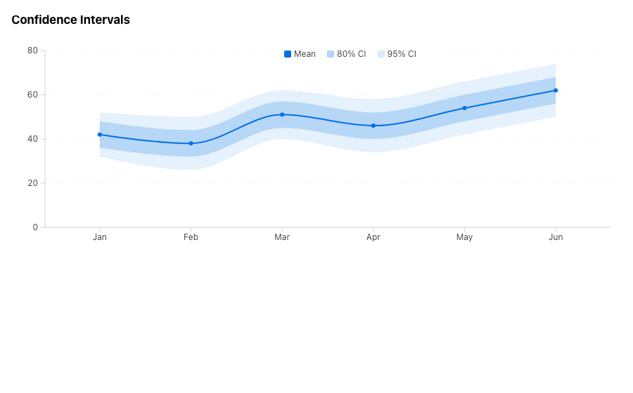
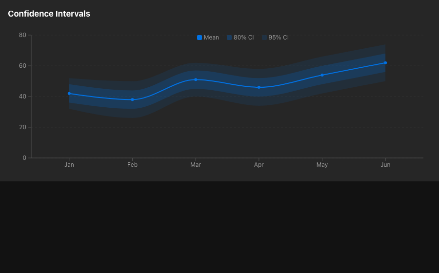
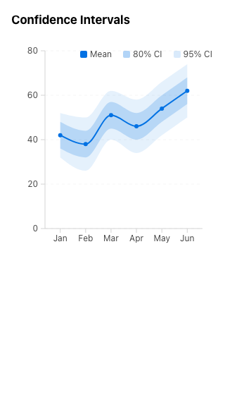
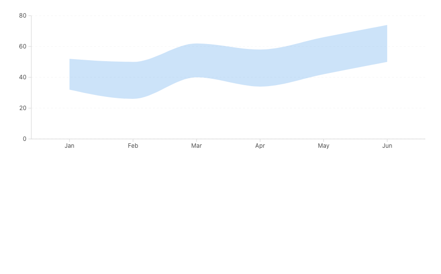
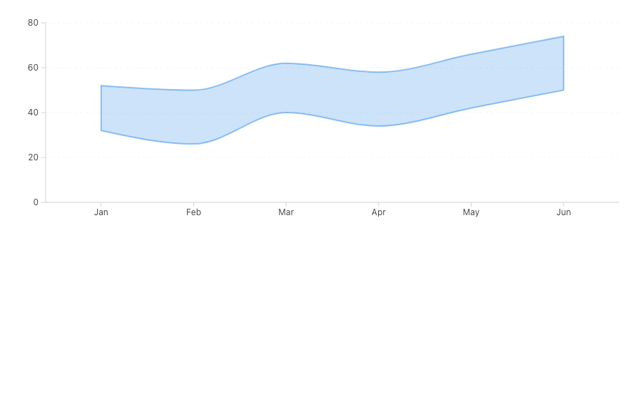
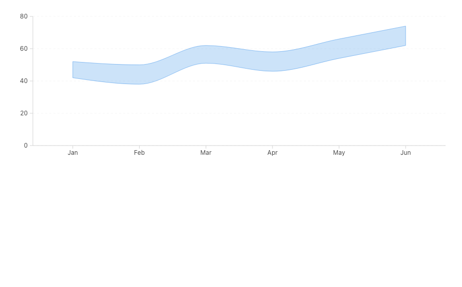

# ChartArea Night Watch audit evidence

Rubric **1.16.6** · base `47ba5526fa93f2bbcb7c0c26ab0a49d86cf37825` · exact source head `2b7755541c8d4d81196b4f64ed903c1c74ae51d4`

- [Post-fix scorecard](scorecard.json)
- [Before scorecard](before-scorecard.json)
- [Closed FR5 inventory](fr5-inventory.json)
- [FR10 eligibility report](fr10-report.json)
- [Visual diff report](visual-diff.json)
- [Rendered contrast pairs](contrast-pairs.json)

## Unchanged rendered output

The audit adds documentation, a draft observational contract, and an owned Storybook fixture. It does not change ChartArea runtime paint. All eight matched before/after PNG pairs are byte-identical.

| Before | Exact head |
|---|---|
|  |  |
|  |  |
|  |  |

## Exact-head owned-story coverage

| Fill only | Edge stroke | Baseline fallback |
|---|---|---|
|  |  |  |

Canonical sensor receipts sit beside every PNG. Additional frames cover dark mode, Stone, RTL, coarse pointer, and forced colors.
